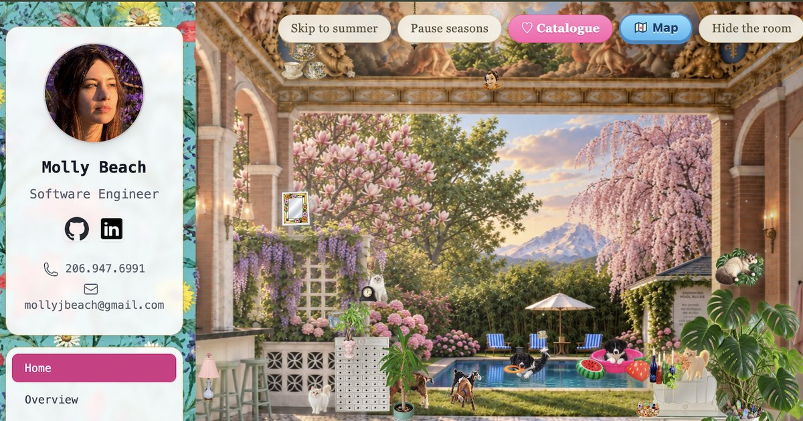

# Molly Beach — Portfolio

**Live at [mollybeach.app](https://mollybeach.app)**



My portfolio has two sides. The sidebar is a conventional résumé: experience, projects, skills, education, awards and certifications. The home page is **the Palais**: a Versailles-style palace terrace you can play with, full of hand-made stickers of my cats, dogs and goats and my furniture. It changes through the four seasons and opens onto **Area M**, a world map of rooms, each built from places I've travelled.

It's React, TypeScript and CSS, with no game engine and no canvas library. It all runs in the browser, with an optional Supabase backend.

---

## ✨ The Palais

### A room that lives through the year
- **Four seasons on a 160-second year.** Spring, summer, autumn and winter photographs crossfade on a CSS animation timeline. **Skip** jumps ahead by driving the animations directly through the Web Animations API (`currentTime`, `playbackRate`), and **Pause** freezes the whole year, every room at once.
- **Weather that follows the photographs.** Snow in winter, falling leaves in autumn and cottonwood fluff in summer come from a canvas particle system. It reads how far each season's photo has faded in, so the weather thickens as a season arrives and thins as it leaves.
- **Visitors.** Hummingbirds and dragonflies fly through now and then on a small requestAnimationFrame flight engine.
- **Moving parts.** Honeysuckle's tricycle wheels spin, and her sewing machine's needle goes up and down while the fabric feeds through. Each sticker is cut into layers and animated separately.
- **Phone layout.** Phones get their own portrait photographs and layout rather than a squashed desktop.

### ~100 stickers you can rearrange
- **Drag anything anywhere.** Pick-up hit-testing checks the image's own transparency, so you grab the cat and not the empty corner of its picture. The item you're holding comes to the front, and a corner handle resizes it.
- **Positions that survive resizing.** Moves are stored as fractions of the stage (container query units, `cqw`/`cqh`), so an arrangement holds at any window size. The scene is mapped onto whichever background photo is showing: taller, wider or phone.
- **A dress-up-game catalogue.** Every sticker sits on a shelf (Furniture, House plants, Cats, Dogs, Goats, Artwork, Hanging lights, Teacups, Trinkets…). Heart them in or out of the room, one at a time or a whole shelf at once.
- **A layout for each season.** Each season has its own default arrangement: the autumn table only in autumn, the dogs in the pool in spring and summer. The room glides into the new layout when the season turns.

### Area M: the world map
A cute, video-game-style level select. Honeysuckle hops along a dotted path between stops on an island inside a shimmering rainbow wall. Each stop is a region blended from real trips, and many of them are rooms you can walk into:

| Room | |
|---|---|
| 🏛 The Palais | home, the terrace |
| 🍰 The Kitchen | the whole kitchen behind the terrace's marble bar |
| 🛁 The Bathroom | the blush bathroom through the terrace's right arch |
| 🌿 The Glasshouse | an iron-and-glass garden conservatory |
| 🏠 The Lakehouse | a glass lake house with a red bridge and a boathouse, in four seasons |
| 👗 The Wardrobe Wing | a pink closet with lemon wallpaper and a waterfall, in four seasons |
| ♨️ The Steaming Lagoon | a blue lagoon under the northern lights, in four seasons |
| 🌲 The Rainwood | a fern-covered conservatory in a rainforest |
| 🎵 The Amphitheatre | a festival stage on a canyon rim at sunset |
| 🕌 The City of Domes | a marble bath above domes, trams and gondolas |
| 💜 The Jacaranda Quarter | a balcony over a purple jacaranda street at dusk |
| 🐢 The Glass Reef | a seashell pavilion half under the sea |

Rooms keep their place in the address (`mollybeach.app/#lagoon`), so a refresh or a shared link opens the same room. All rooms turn through the seasons together.

### Saved looks (Supabase)
Signed in, I can save the room as a named look, file it under a season, make it that season's default, and keep older looks to go back to. Everyone can read looks, but only editors can change them, and row-level security enforces that in the database, not in the UI.

---

## 📄 The résumé side

- **Experience:** an expandable timeline of roles, with project details
- **Projects:** project cards with live preview screenshots (Microlink)
- **Skills, Education, Awards, Certifications**
- **Résumé:** a printable résumé page
- **Link previews:** social media previews and meta tags (react-helmet-async)

## 🛠 Tech stack

- **React 18** + **TypeScript** (Create React App), **react-router**
- **Tailwind CSS** for the résumé pages; hand-written, scoped CSS for the Palais (container queries, CSS animations, custom properties)
- **Web Animations API**, **Canvas 2D**, **requestAnimationFrame**, **ResizeObserver**
- **Supabase** (Postgres, row-level security, auth, SQL functions), loaded lazily so the room never waits on it
- **Image pipeline:** background removal (rembg), OpenCV feature matching (SIFT and homography) to align the season photographs, WebP export
- **Hosting:** Vercel

## 📂 Project structure

```
portfolio/
├── public/
│   ├── palais/              # room photographs (per season) and sticker cut-outs
│   └── social-preview-palais-v2.jpg
├── src/
│   ├── components/          # résumé pages: Sidebar, Experience, Projects, Skills…
│   └── palais/              # the Palais
│       ├── PalaisHome.tsx   # the terrace and everything placed in it
│       ├── Room.tsx         # season photographs for the terrace
│       ├── SeasonRoom.tsx   # the other rooms off the map
│       ├── WorldMap.tsx     # Area M, the level-select map
│       ├── place.ts         # which room you're in (#hash routing)
│       ├── seasons.ts       # skip / pause via the Web Animations API
│       ├── Weather.tsx      # snow, leaves, fluff
│       ├── Flyers.tsx       # hummingbirds and dragonflies
│       ├── Draggable.tsx    # drag, stack, resize
│       ├── Catalogue.tsx    # the sticker catalogue
│       ├── arrangement.ts   # default positions, per-season layouts
│       ├── layouts/         # spring / summer / autumn / winter layouts (JSON)
│       └── LayoutsShelf.tsx # saved looks (Supabase)
└── supabase/migrations/     # tables, row-level security and SQL functions
```

## 🚀 Running it locally

```bash
git clone https://github.com/mollybeach/portfolio.git
cd portfolio
npm install
npm start
```

Open [http://localhost:3000](http://localhost:3000).

The site works fully without a backend. To turn on saved looks:

1. Create a Supabase project and run the SQL files in `supabase/migrations/` in order, in the SQL Editor.
2. Add your project's URL and publishable (anon) key to `.env.local`:
   ```
   REACT_APP_SUPABASE_URL=https://<your-project>.supabase.co
   REACT_APP_SUPABASE_ANON_KEY=<publishable key>
   ```
3. Create a user in Supabase Auth and add it to `palais_editors`. The steps are in `supabase/README.md`.

## 🌐 Deployment

The site is hosted on **Vercel**, which builds from GitHub on every push. The Supabase variables above are set in the Vercel project's environment variables.

## 📞 Contact

- [LinkedIn](https://www.linkedin.com/in/mollybeach)
- [GitHub](https://github.com/mollybeach)
- [mollyjbeach@gmail.com](mailto:mollyjbeach@gmail.com)
